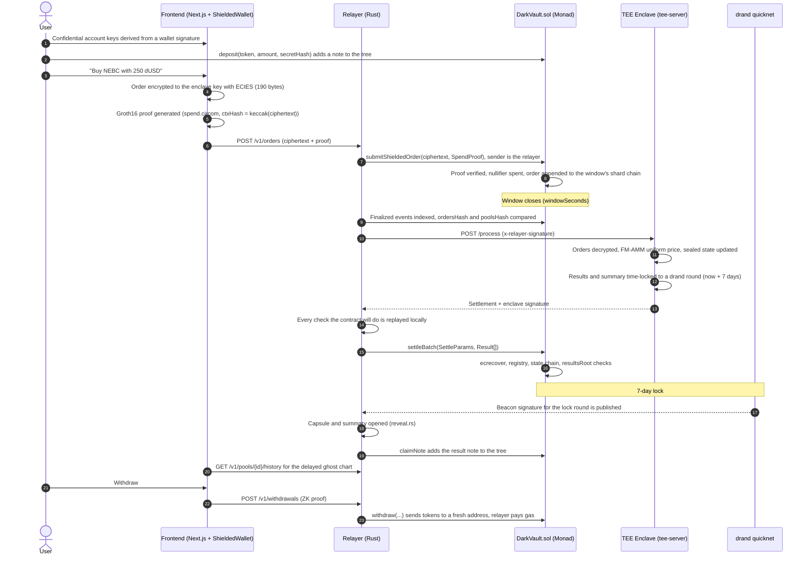

<div align="center">


# darkscreener

**Hidden price, visible project: a confidential DEX powered by ZK + TEE that whales and influencers can't manipulate.**

[](https://testnet.monad.xyz)
[](tee-core/)
[](contracts/)
[](circuits/)
[](frontend/)
[](oyster/)
[](tee-core/src/timelock.rs)

</div>

---
darkscreener is a privacy-focused dark pool DEX running on Monad. By hiding live price, trading volume, and wallet activity, it structurally makes manipulation based on pump-and-dump, front-running, and wallet tracking impossible. Orders are encrypted in the browser and sent without address binding using zero-knowledge proof (ZK). They are matched in bulk at a single price in a trusted hardware environment (TEE). Results remain in a cryptographic time lock for 7 days. Investors make decisions based on the project's signed news and fundamentals, not on the chart.
---

## 🎯 Problem & Solution

### Problem

- **Price manipulation:** Large social media accounts pump a token, show the rally on the live chart, and get their followers to buy while they sell. The live price is the fuel of this game.
- **Front-running and MEV:** A public mempool and a public order book make it possible to jump ahead of large orders and run sandwich attacks.
- **Wallet tracking:** Every trade is tied to an address. "Smart money" bots copy large wallets and the investor's strategy is exposed.
- **Wrong focus:** Users decide by looking at candlestick charts instead of at what the project actually does.

### Solution

- **No live price:** The UI has no live price, no live volume, and no list of holders. Price history is only shown **with a 7-day delay** (`frontend/components/GhostChart.tsx`, `frontend/lib/ghost.ts`). The last 7 days are the "dark zone".
- **Results locked for 7 days:** Users also only learn how many tokens they bought after 7 days. Batch results and summaries are time-locked with **drand quicknet** (`tee-core/src/timelock.rs`). Nobody, including the enclave, can open them early.
- **Encrypted orders:** Orders are encrypted in the browser to the enclave key with ECIES (`sdk/src/order.mjs`, `DSX-ECIES-v1`). Only a 190-byte ciphertext is visible on chain (`CIPHERTEXT_LEN = 190`).
- **Addressless trading:** Funds are deposited into Poseidon notes. Orders spend them with a ZK proof (`circuits/src/spend.circom`) and are submitted by the **relayer**. On chain, the sender is the relayer, not the user. Withdrawals are gasless too and can go to a fresh address.
- **Single price, no MEV:** All orders within a window (`windowSeconds`) are matched at the same price in the enclave using **FM-AMM uniform clearing** (`tee-core/src/clearing.rs`). Ordering gives no advantage.
- **Decision data = news:** Projects publish **signed news** only with their registered keys (`relayer/src/news.rs`, EIP-191). Fake announcements are rejected.
- **Trust minimization:** The contract verifies the enclave signature, the order chain (`ordersHash`), the pool chain (`poolsHash`), and the state chain. The relayer cannot lie. If settlement stalls for 2 days, an **escape hatch** (`activateEscape`, `ESCAPE_DELAY = 2 days`) returns funds without the enclave.

---

## ⚙️ System Architecture

### Components

| Layer | Directory | Responsibility |
|---|---|---|
| **TEE core** | `tee-core/` | Pure Rust: ECIES (`ecies.rs`), order format v2 / lot-sell v3 (`order.rs`), FM-AMM (`clearing.rs`), sealed state (`state.rs`), settlement digest (`digest.rs`), drand tlock (`timelock.rs`), Poseidon notes (`note.rs`), `process_batch` (`batch.rs`). No network, clock, filesystem, or TEE API. |
| **TEE provider** | `tee-attest/` | `TeeProvider` trait: `key_seed`, `trusted_unix_time`, `attest`, `key_is_direct`. Providers: `LocalDev` (hardware-free development) and `Oyster` (Marlin Oyster CVM; key from KMS at `127.0.0.1:1100`, attestation at `127.0.0.1:1300`). |
| **Enclave server** | `tee-server/` | Axum HTTP: `GET /health`, `GET /pubkey`, `GET /attestation`, `POST /process`. `ForkGuard` signs only one order set per `(batch_id, prev_state_hash)`. If `RELAYER_ADDRESSES` is set, it only accepts relayer-signed (`x-relayer-signature`) requests. |
| **Contracts** | `contracts/` | `DarkVault.sol` (shielded note tree, confidential orders, windows, 16-shard order chains, Merkle claim, escape hatch, `createPoolFor`), `gateway/DarkUSD.sol` (1 dUSD = $1, authorized minter), `gateway/MonGateway.sol` (MON → confidential dollar note; keyless CREATE2 box + `redeem` on withdrawal), `launch/LaunchPad.sol` + `LaunchToken.sol` (permissionless, fixed-supply project launch), `OwnerEnclaveRegistry.sol`, `SpendVerifier.sol` (Groth16), `lib/PoseidonTree.sol` (depth 20, 64-root history), `lib/DarkPoolLib.sol`, `lib/DrandQuicknet.sol`, `lib/NoteLib.sol`. |
| **ZK circuit** | `circuits/` | `spend.circom` → `Spend(20)`: membership proof, nullifier, change note, spend commitment, `ctxHash` binding (6,961 constraints). `scripts/ceremony.sh` runs a local Groth16 ceremony. |
| **Relayer** | `relayer/` | Rust + alloy: `index.rs` (indexes only `finalized` blocks in chunks of 100), `settler.rs` (verifies the enclave response locally with every check the contract does, then submits), `claimer.rs` (`returnRefunded` / `claimNote`), `reveal.rs` (opens capsules with the drand beacon), `news.rs`, `price.rs`, `api.rs`. |
| **SDK** | `sdk/` | Browser and Node client: `ecies.mjs`, `order.mjs`, `note.mjs` (poseidon-lite, `Tree`, `buildSpendInput`), `relayer.mjs`, `news.mjs`. E2E: `e2e/local.mjs`, `e2e/seed.mjs`, `e2e/post-news.mjs`. |
| **Frontend** | `frontend/` | Next.js 16, multi-page: `/` Explore, `/token/[poolId]` (ghost chart, clickable signed news, project details, `TradeBox`: confidential buy in dollars / confidential sell by percentage), `/portfolio` (known cash + "Unknown" positions, lock countdowns, backup), `/launch` (token creation form), `/guide`. `components/app/`: `AppProvider` (account, note book, auto-deposit), `Shell`, `FundsModal` (deposit address with QR + gasless withdrawal). `lib/wallet.ts`: `ShieldedWallet.fromSecret`. English by default, Turkish optional (`lib/i18n.ts`). |

### End-to-end flow



### Security model and constants

| Parameter | Value | Location |
|---|---|---|
| Result lock | `LOCK_SECONDS = 7 days` (+ `UNLOCK_MARGIN_SECONDS = 900`) | `tee-core/src/timelock.rs`, `tee-core/src/batch.rs` |
| Upper bound on lock | `MAX_EXTRA_LOCK = 1 days` | `DarkVault.sol` |
| Escape hatch | `ESCAPE_DELAY = 2 days` | `DarkVault.sol` |
| Order size | `CIPHERTEXT_LEN = 190` (128-byte plaintext + 62 bytes ECIES overhead) | `DarkVault.sol`, `tee-core/src/order.rs` |
| Capacity | 16 shards × `MAX_ORDERS_PER_SHARD = 16` per window; enclave `MAX_ORDERS_PER_BATCH = 2048` | `DarkVault.sol`, `tee-core/src/batch.rs` |
| Note tree | Poseidon, depth 20, `ROOT_HISTORY = 64` | `contracts/src/lib/PoseidonTree.sol` |
| Settlement digest | chain, vault, batch, prev/new state hash, resultsRoot, unlockRound, capsule/summary hash, quoteToken, feeBps, ordersHash, poolsHash, reservesCommitment | `tee-core/src/digest.rs` ↔ `DarkPoolLib.settlementDigest` |

> **Current status:** Until the Oyster CVM deployment is done, the enclave runs with `TEE_PROVIDER=local`. In this mode the cryptography, ZK, and time lock are real, but there is no hardware guarantee. The UI's **Security** tab states this explicitly. Migrating to Oyster: [oyster/README.md](oyster/README.md).

---

## 🚀 Key Features

- **Ghost chart:** Only candles, volume, and the 30-day TWAP from unlocked batches are shown. The last 7 days are a hatched "dark zone" with a countdown to the next unlock.
- **Walletless deposit:** The confidential account is a single key in the browser (optionally derived from a wallet signature). MON is sent to the account's own deposit address (QR); `AppProvider` automatically converts it into a confidential dollar note via `MonGateway.depositNative` (testnet demo rate `usdPerMon`). Withdrawals go out as MON or dUSD, with the relayer paying gas.
- **Buy in dollars, sell by percentage:** Buying only asks for a dollar amount, selling only for a percentage (25/50/75/100%/other); the amount is split across several notes if needed. The amount bought and the sale proceeds become visible after 7 days.
- **Portfolio:** Known cash, deposited and sold amounts; locked positions are shown as "Unknown" with the time left until unlock.
- **Token launch:** The `/launch` form asks for detailed project information; `LaunchPad.launch` mints a fixed-supply token and opens the confidential pool with initial MON liquidity. Metadata is bound to the on-chain `metadataHash`; the account that launched the project can publish signed news from the UI.
- **ZK in the browser:** `ShieldedWallet` generates the Groth16 proof in the browser with `snarkjs` (about 0.4 s locally). The note book is stored in the browser and can be backed up.
- **Confidential buy/sell:** Order amount, direction, and pool ID (`pool_id`) are inside the ciphertext. A single vault manages many pools, so not even which project is being bought is visible on chain.
- **Automatic refund:** Orders that can't be decrypted or are invalid become `Refunded`. The spent amount returns to the tree as a new confidential note without the user doing anything.
- **Gasless withdrawal:** `POST /v1/withdrawals` is bound to the proof via `withdrawContext(recipient)`. Funds go to a fresh address with a zero balance.
- **Signed project news:** A `darkpool-news:v1` message is signed with the project's registered `newsSigners` key. News appears on the chart and in the "Trending" ticker. Projects are ranked not by price but by the number of news posts in the last 24 hours.
- **Trustless relayer verification:** `settler.rs` verifies the enclave response with exactly the same checks as the contract before submitting, so no gas is wasted on failing transactions (Monad charges for the gas limit).
- **Fork protection:** A different order set is never signed for the same batch (HTTP 409). This blocks the "diff two summaries to isolate one user's order" attack.
- **Escape hatch:** `activateEscape`, `escapeReturnOrder`, `escapeReclaimPool`, `revealFinalReserves`, and `escapeWithdrawLiquidity`. Thanks to the salted `reservesCommitment`, LPs can exit without the enclave.
- **Provider-agnostic TEE:** Business logic lives in `tee-core` as pure Rust. Oyster, Nitro, or Phala are swapped by implementing `TeeProvider`. Clearing can also be moved to FHE thanks to the `ClearingEngine` trait.

---

## 💻 Installation

### Requirements

| Tool | Version | Note |
|---|---|---|
| Rust | 1.95+ | `rustup` |
| Foundry | latest | `forge`, `cast`, `anvil` |
| Node.js | 20+ (tested with 24) | `npm` |
| jq, bc | any | for the scripts |
| Docker | optional | enclave image / Oyster |

`scripts/setup.sh` installs `circom` 2.2.3 itself.

### Local development (anvil + real enclave + real relayer)

```bash
# 1) Clone
git clone https://github.com/Omeraydognn/darkscreener.git
cd darkscreener

# 2) Non-git dependencies: forge-std, OpenZeppelin, poseidon-solidity, circom, circuits/sdk npm packages
./scripts/setup.sh
npm --prefix frontend install

# 3) Build
cargo build --workspace
(cd contracts && forge build)

# 4) Tests (Rust, Solidity, Circom, SDK cross-language)
cargo test --workspace
(cd contracts && forge test)
(cd circuits && npm test)
(cd sdk && npm test)

# 5) End-to-end: anvil + enclave + relayer + user scenario
./scripts/e2e-local.sh

# 6) UI: local chain rewound 16 days + history unlocked with real drand.
#    This command stays running. It writes frontend/.env.local itself.
./scripts/dev-stack.sh

# 7) In a separate terminal start the UI, then open http://localhost:3000
npm --prefix frontend run dev
```

### Deploying to Monad testnet

```bash
# 1) Generate project keys (.testnet/, git-ignored) and show the deployer address
./scripts/testnet.sh status

# 2) Send MON from the Monad testnet faucet to the deployer address (at least 3, 10+ recommended)

# 3) Contracts + 3 demo projects (NEBC, ORBR, VELS / dUSD); remaining MON is moved to the relayer
./scripts/testnet.sh deploy

# 4) Enclave + relayer (stays running). frontend/.env.local is written for testnet
./scripts/testnet.sh up

# 5) In a separate terminal, use the UI with MetaMask
npm --prefix frontend run dev

# 6) Optional: signed news on behalf of a demo project
./scripts/testnet.sh news 1 "Title" "Body"
```

### Environment variables

The scripts write these variables themselves (`frontend/.env.local`, `.dev/relayer.env`, `.testnet/relayer.env`). For a manual setup, step by step:

**1. Enclave** (`tee-server`)

| Variable | Description |
|---|---|
| `TEE_PROVIDER` | `local` (default) or `oyster` |
| `LOCAL_SEED_PATH` | `local`: persistent key seed file |
| `OYSTER_KMS_PATH` | `oyster`: KMS derivation path (`darkpool-enclave-v1`) |
| `RELAYER_ADDRESSES` | relayer addresses allowed to call `/process` (required on a public network) |
| `LISTEN_ADDR` | default `0.0.0.0:8080` |

**2. Relayer** (`cp .env.relayer.example .env.relayer`)

| Variable | Description |
|---|---|
| `RPC_URL` | `https://testnet-rpc.monad.xyz` |
| `VAULT_ADDRESS`, `DEPLOY_BLOCK` | from `contracts/deployments/10143.json` |
| `ENCLAVE_URL` | enclave address |
| `RELAYER_PRIVATE_KEY` | a separate key used only for gas (**never commit it**) |
| `LOG_CHUNK` / `POLL_MS` / `RATE_PER_MIN` | `100` / `1000` / `30` |
| `PROJECTS_FILE` / `NEWS_FILE` | project metadata and signed news store |

**3. Frontend** (`frontend/.env.local`)

| Variable | Description |
|---|---|
| `NEXT_PUBLIC_RPC_URL` | chain RPC |
| `NEXT_PUBLIC_RELAYER_URL` | relayer API |
| `NEXT_PUBLIC_CHAIN_ID` | `10143` (testnet) or `31337` (anvil) |
| `NEXT_PUBLIC_VAULT` | `DarkVault` address |
| `NEXT_PUBLIC_TEST_TOKENS` | `1`: demo token faucet |
| `NEXT_PUBLIC_DEV_CHAIN` | `1`: anvil only (temporary developer wallet) |
| `NEXT_PUBLIC_EXPLORER_URL`, `NEXT_PUBLIC_CHAIN_NAME` | display |

### When formats change

```bash
# If the enclave format changes, regenerate the Rust ↔ Solidity ↔ Circom ↔ JS fixture
./scripts/gen-fixture.sh

# If the circuit changes, redo the ceremony + verifier + fixture together
./circuits/scripts/ceremony.sh && ./scripts/gen-fixture.sh
```

---

## 🎥 MVP

| | Link |
|---|---|
| 🌐 Live app | https://darkscreener.vercel.app/ |


After deployment, all addresses are written to `contracts/deployments/10143.json`.

### Test coverage

| Package | Command | Contents |
|---|---|---|
| `tee-core`, `tee-attest`, `tee-server`, `relayer` | `cargo test --workspace` | 46 tests: ECIES, clearing, sealed state, drand vector (round 1000), circomlib Poseidon vectors, fork protection, relayer signature authorization |
| `contracts` | `forge test` | 29 tests: Rust↔Solidity compatibility via fixture, conservation (vault drains to zero on escape), attacks, gas profile, MON gateway and launchpad |
| `circuits` | `npm test` | 4 tests: valid/invalid witnesses for `Spend(20)` |
| `sdk` | `npm test` | 4 tests: JS ↔ Rust ECIES, order and result format |
| E2E | `./scripts/e2e-local.sh` | MON deposit → confidential buy → refund of a malformed order → settle → 7 days → claim → gasless withdrawal as MON and dUSD |

Gas measured on an anvil fork of Monad testnet (EVM pricing): `submitShieldedOrder` ≈ 1.15M, `settleBatch` with 2 orders ≈ 246k, `withdraw` ≈ 1.13M.

---

## 🔮 Future Vision

- **From TEE to FHE:** Clearing currently runs in the TEE behind the `ClearingEngine` trait (`FmAmm`). Once an FHE coprocessor becomes available in the Monad ecosystem (e.g. fhEVM-style solutions offering encrypted addition/multiplication), order totals and reserve updates can be computed on chain in encrypted form, removing hardware trust entirely. Today's blocker is that encrypted division in FHE (the FM-AMM price `p = (y + 2B′)/(x + 2A′)`) is impractical. Hybrid model: aggregation in FHE, price via threshold decryption.
- **Hardware TEE:** Migration to Marlin Oyster CVM (`oyster/docker-compose.yml`). Anyone can verify the enclave address from the image identity with `oyster-cvm kms-derive`. Binding the registry to on-chain Nitro attestation verification is part of this step.
- **Mainnet security:** Perpetual Powers of Tau + a multi-party phase-2 ceremony, multisig/DAO governance instead of `OwnerEnclaveRegistry`, and an independent audit.
- **Encrypted limit orders:** Adding a price limit to the order format (`order.rs` v2).
- **Staking rewards for holders:** Users holding a project token will be able to stake it as a confidential note and earn rewards. The reward pool will be funded from the project treasury and trading fees (`feeBps`). Stake amounts and reward shares will be computed inside the enclave and distributed as new confidential notes, so who holds how much stays hidden. The goal is to reward investors who believe in the project long term instead of short-term flipping, further reducing the pump-and-dump incentive.
- **Persistent infrastructure:** Moving the relayer to a server, multiple relayers (`RELAYER_ADDRESSES` already accepts a list), and index snapshots.
