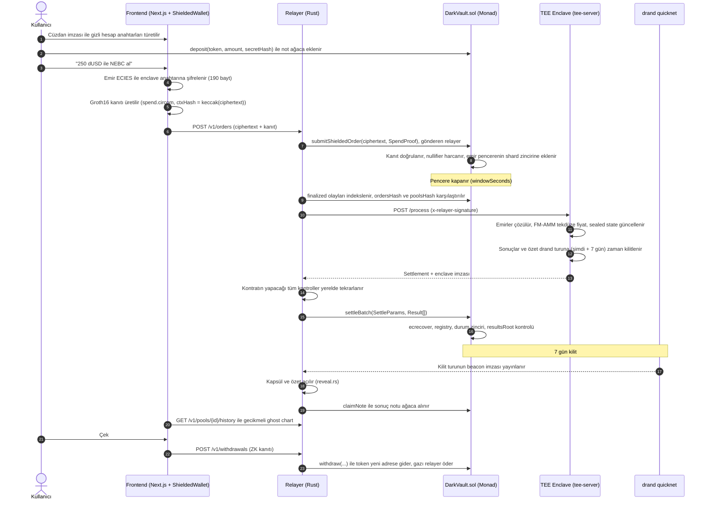

<!--
ai_context:
  project: darkscreener
  category: privacy DEX / dark pool
  chain: Monad Testnet (chainId 10143, EVM Cancun)
  stack: [Rust (tee-core, tee-attest, tee-server, relayer), Solidity 0.8.30 (Foundry), Circom 2.2.3 + Groth16 (snarkjs), Next.js 16 + React 19, viem, drand quicknet timelock]
  entrypoints:
    contracts: contracts/src/DarkVault.sol
    circuit: circuits/src/spend.circom
    enclave: tee-server/src/main.rs -> tee-core/src/batch.rs::process_batch
    relayer: relayer/src/main.rs
    frontend: frontend/app/p/[poolId]/page.tsx -> frontend/components/Terminal.tsx
    client_crypto: sdk/src/{ecies,order,note,relayer}.mjs
  invariants:
    - Byte formats are identical across Rust (tee-core), Solidity (DarkPoolLib), Circom and JS (sdk); verified by contracts/test/fixtures/e2e.json
    - Trade results are time-locked for 7 days with drand; nobody (including the enclave) can open them early
    - The enclave is stateless; vault state is sealed and stored on-chain as a hash chain
  status: all phases implemented and tested locally; Monad testnet deploy scripted (scripts/testnet.sh); enclave runs TEE_PROVIDER=local until Oyster CVM deploy
-->

> **AI Context:** `darkscreener` Monad testnet üzerinde çalışan, **fiyatı ve işlemleri gizleyen bir dark pool DEX**'tir. Emirler tarayıcıda şifrelenir ve ZK kanıtıyla (Groth16, `spend.circom`) shielded not havuzundan harcanır. Relayer gönderir, TEE enclave batch halinde FM-AMM ile eşleştirir, `DarkVault.settleBatch` enclave imzasını doğrular. Sonuçlar **7 gün boyunca drand zaman kilidindedir**. Kullanıcılar canlı fiyat yerine proje haberlerini ve 7 gün gecikmeli "ghost chart"ı görür. Kod dilleri: Rust, Solidity, Circom, TypeScript. Ana dizinler: `tee-core/`, `contracts/`, `circuits/`, `relayer/`, `sdk/`, `frontend/`.

<div align="center">

<!-- LOGO: docs/logo.png (placeholder) -->


# darkscreener

**Fiyatı gizli, projesi görünür: balinaların ve fenomenlerin manipüle edemediği, ZK + TEE ile çalışan gizli DEX.**

[](https://testnet.monad.xyz)
[](tee-core/)
[](contracts/)
[](circuits/)
[](frontend/)
[](oyster/)
[](tee-core/src/timelock.rs)

</div>

---

## 🎯 Problem & Çözüm

### Problem

- **Fiyat manipülasyonu:** Büyük sosyal medya hesapları bir token'ı pompalar ve canlı grafikte yükselişi gösterip takipçilerine sattırır. Canlı fiyat bu oyunun yakıtıdır.
- **Front-running ve MEV:** Açık mempool ve açık emir defteri, büyük emirlerin önüne geçilmesini ve sandviç saldırılarını mümkün kılar.
- **Cüzdan takibi:** Her alım-satım bir adrese bağlıdır. "Akıllı para" botları büyük cüzdanları kopyalar, yatırımcının stratejisi ifşa olur.
- **Yanlış odak:** Kullanıcılar projenin ne yaptığına değil mum grafiğine bakarak karar verir.

### Çözüm

- **Canlı fiyat yok:** Arayüzde canlı fiyat, canlı hacim ve yatırımcı listesi hiç yoktur. Fiyat geçmişi yalnızca **7 gün gecikmeli** gösterilir (`frontend/components/GhostChart.tsx`, `frontend/lib/ghost.ts`). Son 7 gün "karanlık bölge"dir.
- **Sonuç 7 gün kilitli:** Kullanıcı kaç token aldığını da 7 gün sonra görür. Batch sonuçları ve özetleri **drand quicknet** ile zaman kilitlidir (`tee-core/src/timelock.rs`). Enclave dahil kimse erken açamaz.
- **Şifreli emirler:** Emir tarayıcıda enclave anahtarına ECIES ile şifrelenir (`sdk/src/order.mjs`, `DSX-ECIES-v1`). Zincirde yalnızca 190 baytlık şifreli metin görünür (`CIPHERTEXT_LEN = 190`).
- **Adressiz alım-satım:** Fonlar Poseidon notlarına yatırılır. Emirler ZK kanıtıyla (`circuits/src/spend.circom`) harcanır ve **relayer** tarafından gönderilir. Zincirde gönderen kullanıcı değil relayer'dır. Çekimler de gazsızdır ve yeni bir adrese yapılabilir.
- **MEV'siz tek fiyat:** Bir pencere (`windowSeconds`) içindeki tüm emirler enclave'de **FM-AMM tekdüze clearing** ile aynı fiyattan eşleşir (`tee-core/src/clearing.rs`). Sıralama avantajı yoktur.
- **Karar verisi = haber:** Projeler yalnızca kayıtlı anahtarlarıyla **imzalı haber** yayınlar (`relayer/src/news.rs`, EIP-191). Sahte duyuru reddedilir.
- **Güven minimizasyonu:** Kontrat enclave'in imzasını, emir zincirini (`ordersHash`), havuz zincirini (`poolsHash`) ve durum zincirini doğrular. Relayer yalan söyleyemez. Settlement 2 gün durursa **kaçış kapağı** (`activateEscape`, `ESCAPE_DELAY = 2 days`) fonları enclave olmadan iade eder.

---

## ⚙️ Sistem Mimarisi

### Bileşenler

| Katman | Dizin | Sorumluluk |
|---|---|---|
| **TEE çekirdeği** | `tee-core/` | Saf Rust: ECIES (`ecies.rs`), emir formatı v2 (`order.rs`), FM-AMM (`clearing.rs`), sealed state (`state.rs`), settlement özeti (`digest.rs`), drand tlock (`timelock.rs`), Poseidon notları (`note.rs`), `process_batch` (`batch.rs`). Ağ, saat, dosya veya TEE API'si içermez. |
| **TEE sağlayıcı** | `tee-attest/` | `TeeProvider` trait'i: `key_seed`, `trusted_unix_time`, `attest`, `key_is_direct`. Sağlayıcılar: `LocalDev` (donanımsız geliştirme) ve `Oyster` (Marlin Oyster CVM; anahtar KMS'ten `127.0.0.1:1100`, attestation `127.0.0.1:1300`). |
| **Enclave sunucusu** | `tee-server/` | Axum HTTP: `GET /health`, `GET /pubkey`, `GET /attestation`, `POST /process`. `ForkGuard` aynı `(batch_id, prev_state_hash)` için tek emir kümesi imzalar. `RELAYER_ADDRESSES` verilirse yalnızca relayer imzalı (`x-relayer-signature`) istekleri kabul eder. |
| **Kontratlar** | `contracts/` | `DarkVault.sol` (shielded not ağacı, gizli emirler, pencereler, 16 shard'lı emir zincirleri, Merkle claim, kaçış kapağı), `OwnerEnclaveRegistry.sol`, `SpendVerifier.sol` (Groth16), `lib/PoseidonTree.sol` (derinlik 20, 64 kök geçmişi), `lib/DarkPoolLib.sol`, `lib/DrandQuicknet.sol`, `lib/NoteLib.sol`. |
| **ZK devresi** | `circuits/` | `spend.circom` → `Spend(20)`: üyelik kanıtı, nullifier, para üstü notu, harcama taahhüdü, `ctxHash` bağlaması (6.961 kısıt). `scripts/ceremony.sh` yerel Groth16 töreni. |
| **Relayer** | `relayer/` | Rust + alloy: `index.rs` (yalnızca `finalized` blokları 100'lük parçalarla indeksler), `settler.rs` (enclave yanıtını kontratın tüm kontrolleriyle yerelde doğrular, sonra gönderir), `claimer.rs` (`returnRefunded` / `claimNote`), `reveal.rs` (drand beacon ile kapsülleri açar), `news.rs`, `api.rs`. |
| **SDK** | `sdk/` | Tarayıcı ve Node istemcisi: `ecies.mjs`, `order.mjs`, `note.mjs` (poseidon-lite, `Tree`, `buildSpendInput`), `relayer.mjs`, `news.mjs`. E2E: `e2e/local.mjs`, `e2e/seed.mjs`, `e2e/post-news.mjs`. |
| **Frontend** | `frontend/` | Next.js 16 terminali: `Terminal.tsx`, `GhostChart.tsx` (lightweight-charts), `TradePanel.tsx` (Al / Sat / Yatır / Çek), `BottomTabs.tsx` (Haberler, açılan dönemler, Proje, Güvenlik), `lib/wallet.ts` (`ShieldedWallet`: tarayıcıda snarkjs ile kanıt). |

### Uçtan uca akış



### Güvenlik modeli ve sabitler

| Parametre | Değer | Konum |
|---|---|---|
| Sonuç kilidi | `LOCK_SECONDS = 7 gün` (+ `UNLOCK_MARGIN_SECONDS = 900`) | `tee-core/src/timelock.rs`, `tee-core/src/batch.rs` |
| Kilidin üst sınırı | `MAX_EXTRA_LOCK = 1 days` | `DarkVault.sol` |
| Kaçış kapağı | `ESCAPE_DELAY = 2 days` | `DarkVault.sol` |
| Emir boyutu | `CIPHERTEXT_LEN = 190` (128 bayt düz metin + 62 ECIES yükü) | `DarkVault.sol`, `tee-core/src/order.rs` |
| Kapasite | 16 shard × `MAX_ORDERS_PER_SHARD = 16` / pencere; enclave `MAX_ORDERS_PER_BATCH = 2048` | `DarkVault.sol`, `tee-core/src/batch.rs` |
| Not ağacı | Poseidon, derinlik 20, `ROOT_HISTORY = 64` | `contracts/src/lib/PoseidonTree.sol` |
| Settlement özeti | chain, vault, batch, prev/new state hash, resultsRoot, unlockRound, capsule/summary hash, quoteToken, feeBps, ordersHash, poolsHash, reservesCommitment | `tee-core/src/digest.rs` ↔ `DarkPoolLib.settlementDigest` |

> **Güncel durum:** Enclave, Oyster CVM deploy'u yapılana kadar `TEE_PROVIDER=local` ile çalışır. Bu modda kriptografi, ZK ve zaman kilidi gerçektir, ancak donanım garantisi yoktur. Arayüzün **Güvenlik** sekmesi bunu açıkça gösterir. Oyster'a geçiş: [oyster/README.md](oyster/README.md).

---

## 🚀 Temel Özellikler

- **Ghost chart:** Yalnızca kilidi açılmış batch'lerden gelen mumlar, hacim ve 30 günlük TWAP gösterilir. Son 7 gün taralı "karanlık bölge"dir ve bir sonraki açılışa geri sayım içerir.
- **Tarayıcıda ZK:** `ShieldedWallet` Groth16 kanıtını `snarkjs` ile tarayıcıda üretir (yerelde yaklaşık 0,4 sn). Anahtarlar cüzdan imzasından türetilir. Not defteri tarayıcıda tutulur ve yedeği alınabilir.
- **Gizli al/sat:** Emir tutarı, yönü ve havuz kimliği (`pool_id`) şifreli metnin içindedir. Tek vault birden çok havuzu yönetir, dolayısıyla zincirde hangi projenin alındığı bile görünmez.
- **Otomatik iade:** Çözülemeyen ya da geçersiz emir `Refunded` olur. Harcanan tutar, kullanıcı hiçbir işlem yapmadan yeni bir gizli not olarak ağaca döner.
- **Gazsız çekim:** `POST /v1/withdrawals`, `withdrawContext(recipient)` ile kanıta bağlanır. Fonlar bakiyesi sıfır olan yeni bir adrese gider.
- **İmzalı proje haberleri:** `darkpool-news:v1` mesajı projenin kayıtlı `newsSigners` anahtarıyla imzalanır. Haberler grafikte ve "Gündem" şeridinde gösterilir. Projeler fiyata göre değil, son 24 saatteki haber sayısına göre sıralanır.
- **Relayer'a güvensiz doğrulama:** `settler.rs` enclave yanıtını göndermeden önce kontratın kontrollerinin aynısıyla doğrular, böylece başarısız işleme gaz harcanmaz (Monad gaz limitini ücretlendirir).
- **Fork koruması:** Aynı batch için farklı emir kümesi imzalanmaz (HTTP 409). Bu, "iki özetin farkından tek kullanıcının emrini bulma" saldırısını engeller.
- **Kaçış kapağı:** `activateEscape`, `escapeReturnOrder`, `escapeReclaimPool`, `revealFinalReserves` ve `escapeWithdrawLiquidity`. Tuzlu `reservesCommitment` sayesinde LP'ler enclave olmadan çıkabilir.
- **Sağlayıcıdan bağımsız TEE:** İş mantığı `tee-core` içinde saf Rust olarak durur. Oyster, Nitro veya Phala yalnızca `TeeProvider` implementasyonuyla değiştirilir. Clearing de `ClearingEngine` trait'i sayesinde FHE'ye taşınabilir.

---

## 💻 Kurulum

### Gereksinimler

| Araç | Sürüm | Not |
|---|---|---|
| Rust | 1.95+ | `rustup` |
| Foundry | güncel | `forge`, `cast`, `anvil` |
| Node.js | 20+ (24 ile test edildi) | `npm` |
| jq, bc | herhangi | script'ler için |
| Docker | isteğe bağlı | enclave imajı / Oyster |

`circom` 2.2.3'ü `scripts/setup.sh` kendisi kurar.

### Yerel geliştirme (anvil + gerçek enclave + gerçek relayer)

```bash
# 1) Klonla
git clone https://github.com/Omeraydognn/darkscreener.git
cd darkscreener

# 2) Git dışı bağımlılıklar: forge-std, OpenZeppelin, poseidon-solidity, circom, circuits/sdk npm paketleri
./scripts/setup.sh
npm --prefix frontend install

# 3) Derle
cargo build --workspace
(cd contracts && forge build)

# 4) Testler (Rust, Solidity, Circom, SDK çapraz-dil)
cargo test --workspace
(cd contracts && forge test)
(cd circuits && npm test)
(cd sdk && npm test)

# 5) Uçtan uca: anvil + enclave + relayer + kullanıcı senaryosu
./scripts/e2e-local.sh

# 6) Arayüz: 16 gün geriye alınmış yerel zincir + gerçek drand ile açılmış geçmiş.
#    Bu komut açık kalır. frontend/.env.local dosyasını kendisi yazar.
./scripts/dev-stack.sh

# 7) Ayrı bir terminalde arayüzü başlat, sonra http://localhost:3000 adresini aç
npm --prefix frontend run dev
```

### Monad testnet'e deploy

```bash
# 1) Proje anahtarlarını oluştur (.testnet/, git dışı), deployer adresini gör
./scripts/testnet.sh status

# 2) Deployer adresine Monad testnet musluğundan MON gönder (en az 3, önerilen 10+)

# 3) Kontratlar + 3 demo proje (NEBC, ORBR, VELS / dUSD); kalan MON relayer'a aktarılır
./scripts/testnet.sh deploy

# 4) Enclave + relayer (açık kalır). frontend/.env.local testnet'e göre yazılır
./scripts/testnet.sh up

# 5) Ayrı bir terminalde arayüzü MetaMask ile kullan
npm --prefix frontend run dev

# 6) İsteğe bağlı: demo projesi adına imzalı haber
./scripts/testnet.sh news 1 "Başlık" "Metin"
```

### Ortam değişkenleri

Script'ler bu değişkenleri kendisi yazar (`frontend/.env.local`, `.dev/relayer.env`, `.testnet/relayer.env`). Elle kurulum için adım adım:

**1. Enclave** (`tee-server`)

| Değişken | Açıklama |
|---|---|
| `TEE_PROVIDER` | `local` (varsayılan) veya `oyster` |
| `LOCAL_SEED_PATH` | `local`: kalıcı anahtar seed dosyası |
| `OYSTER_KMS_PATH` | `oyster`: KMS türetme yolu (`darkpool-enclave-v1`) |
| `RELAYER_ADDRESSES` | `/process` çağırabilecek relayer adresleri (herkese açık ağda zorunlu) |
| `LISTEN_ADDR` | varsayılan `0.0.0.0:8080` |

**2. Relayer** (`cp .env.relayer.example .env.relayer`)

| Değişken | Açıklama |
|---|---|
| `RPC_URL` | `https://testnet-rpc.monad.xyz` |
| `VAULT_ADDRESS`, `DEPLOY_BLOCK` | `contracts/deployments/10143.json` içinden |
| `ENCLAVE_URL` | enclave adresi |
| `RELAYER_PRIVATE_KEY` | yalnızca gaz için ayrı bir anahtar (**asla commit etmeyin**) |
| `LOG_CHUNK` / `POLL_MS` / `RATE_PER_MIN` | `100` / `1000` / `30` |
| `PROJECTS_FILE` / `NEWS_FILE` | proje meta verisi ve imzalı haber kaydı |

**3. Frontend** (`frontend/.env.local`)

| Değişken | Açıklama |
|---|---|
| `NEXT_PUBLIC_RPC_URL` | zincir RPC |
| `NEXT_PUBLIC_RELAYER_URL` | relayer API |
| `NEXT_PUBLIC_CHAIN_ID` | `10143` (testnet) veya `31337` (anvil) |
| `NEXT_PUBLIC_VAULT` | `DarkVault` adresi |
| `NEXT_PUBLIC_TEST_TOKENS` | `1`: demo token musluğu |
| `NEXT_PUBLIC_DEV_CHAIN` | `1`: yalnızca anvil (geçici geliştirici cüzdanı) |
| `NEXT_PUBLIC_EXPLORER_URL`, `NEXT_PUBLIC_CHAIN_NAME` | görünüm |

### Format değişikliklerinde

```bash
# Enclave formatı değişirse Rust ↔ Solidity ↔ Circom ↔ JS fixture'ını yeniden üret
./scripts/gen-fixture.sh

# Devre değişirse tören + verifier + fixture birlikte yenilenir
./circuits/scripts/ceremony.sh && ./scripts/gen-fixture.sh
```

---

## 🎥 Demo ve Test

| | Bağlantı |
|---|---|
| 🎬 Demo videosu | `[DEMO_VIDEO_LINKI]` |
| 🌐 Canlı uygulama | `[CANLI_LINK]` |
| 📜 `DarkVault` (Monad testnet) | `[VAULT_ADRESI]` → `https://testnet.monadexplorer.com/address/[VAULT_ADRESI]` |
| 🔐 `OwnerEnclaveRegistry` | `[REGISTRY_ADRESI]` |
| ✅ `SpendVerifier` (Groth16) | `[VERIFIER_ADRESI]` |
| 🧾 Enclave attestation | `[ENCLAVE_URL]/attestation` |

Deploy sonrasında tüm adresler `contracts/deployments/10143.json` dosyasına yazılır.

### Test kapsamı

| Paket | Komut | İçerik |
|---|---|---|
| `tee-core`, `tee-attest`, `tee-server`, `relayer` | `cargo test --workspace` | 45 test: ECIES, clearing, sealed state, drand vektörü (tur 1000), Poseidon circomlib vektörleri, fork koruması, relayer imza yetkisi |
| `contracts` | `forge test` | 20 test: fixture ile Rust↔Solidity uyumu, korunum (kaçışta vault sıfıra iner), saldırılar, gaz profili |
| `circuits` | `npm test` | 4 test: `Spend(20)` doğru/yanlış tanıklar |
| `sdk` | `npm test` | 4 test: JS ↔ Rust ECIES, emir ve sonuç formatı |
| E2E | `./scripts/e2e-local.sh` | Yatırma → gizli alım → bozuk emrin iadesi → settle → 7 gün → claim → gazsız çekim |

Monad testnet'in anvil fork'unda ölçülen gaz (EVM fiyatlaması): `submitShieldedOrder` ≈ 1,15M, 2 emirli `settleBatch` ≈ 246k, `withdraw` ≈ 1,13M.

---

## 🔮 Gelecek Vizyonu

- **TEE'den FHE'ye:** Clearing şu an `ClearingEngine` trait'i arkasında TEE'de çalışıyor (`FmAmm`). Monad ekosisteminde bir FHE coprocessor (ör. şifreli toplama/çarpma sunan fhEVM tarzı çözümler) kullanılabilir hale geldiğinde, emir toplamları ve rezerv güncellemeleri şifreli olarak zincirde hesaplanabilir. Böylece donanım güveni tamamen kalkar. Bugünkü engel, FHE'de şifreli bölmenin (FM-AMM fiyatı `p = (y + 2B′)/(x + 2A′)`) pratik olmamasıdır. Hibrit model: toplama FHE'de, fiyat eşik şifre çözme ile.
- **Donanım TEE'si:** Marlin Oyster CVM'e geçiş (`oyster/docker-compose.yml`). Enclave adresi imaj kimliğinden `oyster-cvm kms-derive` ile herkes tarafından doğrulanabilir. Registry'yi zincir üstü Nitro attestation doğrulamasına bağlamak da bu adıma dahil.
- **Mainnet güvenliği:** Perpetual Powers of Tau + çok taraflı phase-2 töreni, `OwnerEnclaveRegistry` yerine multisig/DAO yönetimi ve bağımsız denetim.
- **Şifreli limit emirleri:** Emir formatına (`order.rs` v2) fiyat sınırı eklenmesi.
- **Proje paneli:** Ekiplerin haberlerini arayüzden imzalayıp yayınlayacağı bir sayfa (şu an `sdk/e2e/post-news.mjs` ve `POST /v1/news`).
- **Kalıcı altyapı:** Relayer'ın sunucuya taşınması, çoklu relayer (`RELAYER_ADDRESSES` zaten liste alır) ve indeks anlık görüntüleri.
